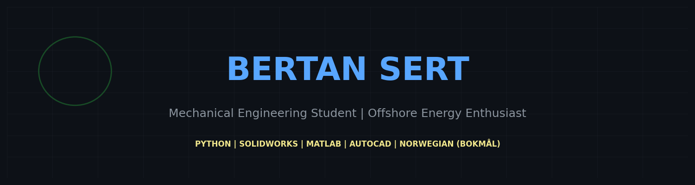

  <h1>Hi there, I'm Bertan Sert! 👋</h1>
  <h3>Mechanical Engineering Student | Offshore Energy Enthusiast</h3>

  

    <b>PYTHON | SOLIDWORKS | MATLAB | AUTOCAD | NORWEGIAN (BOKMÅL)</b>
  

---

### 🚀 Future Offshore Engineer from Turkey 🇹🇷
I am a 3rd-year Mechanical Engineering student aiming for a career in the **Norwegian Offshore Sector** (North Sea). I focus on dynamic analysis, energy systems, and engineering simulations.

### 🔭 What I'm Working On?
* 🌊 **Offshore Energy:** Sustainable solutions for offshore platforms.
* ⚡ **[PiezoEnergy-Sim](https://github.com/BertanSert/PiezoEnergy-Sim):** Stochastic simulation of energy harvesting from footfall traffic using Python & NumPy. *(Updated Project)*
* 🐍 **Engineering Python:** Converting mechanical problems into digital solutions.

### 🛠 Technical Skills
* **Engineering:** Dynamics, Thermodynamics, Fluid Mechanics.
* **Software:** Python (NumPy, Matplotlib), MATLAB, SolidWorks, AutoCAD.
* **Hardware:** High-performance system architecture.

---

### 🗣 Languages
* **Turkish:** Native
* **English:** Professional Working Proficiency 🇺🇸
* **Norwegian (Bokmål):** Learning (A2/B1 Level) 🇳🇴

---

  

---

### 🛠️ Teknolojiler ve Araçlar

### 🌍 Hedef ve Diller

<!--
**BertanSert/BertanSert** is a ✨ _special_ ✨ repository because its `README.md` (this file) appears on your GitHub profile.

Here are some ideas to get you started:

- 🔭 I’m currently working on ...
- 🌱 I’m currently learning ...
- 👯 I’m looking to collaborate on ...
- 🤔 I’m looking for help with ...
- 💬 Ask me about ...
- 📫 How to reach me: ...
- 😄 Pronouns: ...
- ⚡ Fun fact: ...
-->
 

  

    

  

 

  

---

  <h3>📊 Activity & Connectivity</h3>

  
  
   

  

    

  

---

### 🛠 Technologies & Tools

